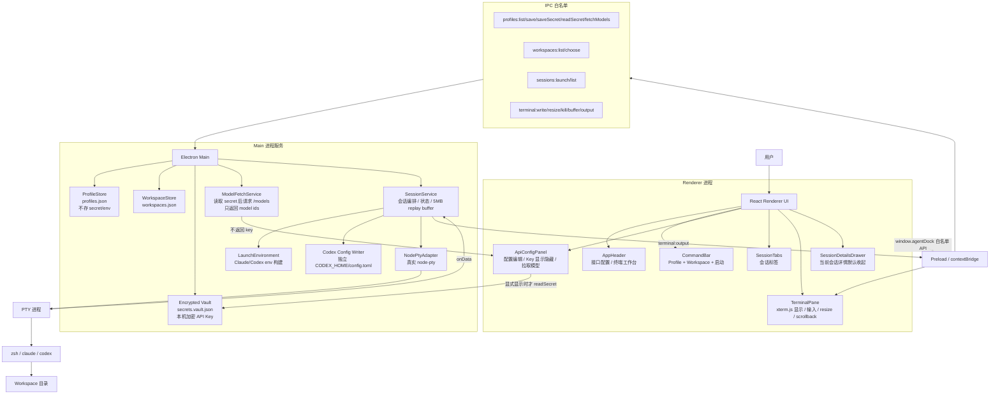

# AgentDock MVP 阶段总结报告

日期：2026-07-03  
项目路径：`/Users/peyoba/Desktop/web/AgentDock`  
当前版本：`agentdock@0.1.0`  
当前 GitHub 提交：`7380001 Ship AgentDock packaged app usability fixes`  
当前正式打包 App：`release/AgentDock-darwin-arm64/AgentDock.app`

---

## 1. 阶段结论

AgentDock MVP 可以视为 **阶段性结束**。

本阶段已经从“需求调研 + UI 方案 + 技术选型”推进到一个可本地运行、可打包、可手动使用的 macOS Electron App。它已经具备核心能力：

- 在一个桌面窗口中管理 Claude / Codex 等 API 配置。
- 按工具类型分组管理 API Profile。
- 选择工作区路径并保存，下次可直接选择。
- 启动真实 `node-pty` 内嵌终端会话。
- 为每个会话注入独立 endpoint / API key / `CODEX_HOME`。
- 在 renderer / preload / IPC 边界避免默认暴露完整 secret 或完整 env。
- 使用本机加密 vault 保存 API Key，避免频繁触发 macOS 系统密码弹窗。
- 支持 API Key 显示/隐藏、模型拉取、模型列表维护。
- 支持终端标签页、会话关闭、会话详情默认收起、终端滚动历史保留。
- 已打包为本地 ad-hoc signed macOS App。

从产品角度看，MVP 已达到“个人本地使用、继续打磨体验”的门槛；从商业分发角度看，还没有进入正式发布阶段，因为 notarization、安装包、自动更新、错误遥测、长期配置迁移等仍未完成。

---

## 2. 开发阶段回顾

### 2.1 需求与设计阶段

项目最初定位为：**可视化 Claude / Codex 多配置内嵌终端工作台**。

核心问题是：Claude CLI、Codex CLI 等工具通常依赖全局配置、环境变量或 CLI 自身配置文件。当用户需要同时运行多套 endpoint / API key / 模型配置时，全局切换会互相影响。

因此 MVP 的核心原则确定为：

1. 不切换全局配置。
2. 每个终端会话独立注入环境。
3. Profile 与 Workspace 解耦。
4. API Key 不明文落盘。
5. 内嵌终端优先，而不是外部终端。
6. 用户能看见当前会话用了哪套 endpoint / workspace。

技术方案最终选择：

```text
Electron + React + TypeScript + xterm.js + node-pty
```

这个选择的理由是：内嵌终端体验最接近 VSCode / Cursor；`xterm.js + node-pty` 是成熟组合；Electron 能同时覆盖桌面 UI、native module、Node 文件系统、IPC、安全边界和打包流程。

### 2.2 Phase 1：MVP 基础层

Phase 1 建立了项目基础：

- Electron + React + TypeScript 项目骨架。
- Vitest / jsdom / React Testing Library 测试体系。
- Profile / Workspace / Session 领域类型。
- Profile / Workspace JSON store。
- preload IPC 白名单与类型合同。
- 启动环境生成器：Claude / Codex endpoint 隔离。
- Renderer 终端优先主界面。
- 当前会话详情默认收起。
- API 配置按工具类型分组。

### 2.3 Phase 2：真实终端与密钥集成

Phase 2 从 fake adapter 进入真实集成：

- 接入真实 `node-pty`。
- 接入真实 Keychain adapter，并用测试 service/account 做验证。
- 打通 SessionService → PTY → Renderer xterm 数据流。
- 支持 terminal write / resize / kill / output subscription。
- 增加启动失败安全处理，避免错误信息泄露 secret/env。
- 为 Codex 创建独立 `CODEX_HOME` 并写入 profile 专属 `config.toml`。
- 打包 macOS App 并处理 native module unpack、codesign、白屏、PATH 等问题。

### 2.4 产品化打磨阶段

在手动测试中发现并修复了大量真实使用问题：

- 打包 App 白屏：修复 Vite `base: './'`。
- Codex 命令找不到：补齐 packaged App 的 PATH。
- Codex Home 不存在：启动前自动创建。
- Codex endpoint 未隔离：写入独立 `CODEX_HOME/config.toml`。
- API Key 输入不明显：配置页增加显式 API Key 输入框。
- API 配置页结构不符合计划：改为独立页面，而不是嵌入主界面。
- 配置页只能一个配置：支持新增多个不同 endpoint/key 的 Profile。
- 高级字段干扰用户：配置 ID、Keychain Service、Keychain Account、Codex Home 默认隐藏，只读展示。
- macOS 系统密码频繁弹出：从默认 Keychain 读写改为本机加密 vault，避免反复授权弹窗。
- 模型选择不足：支持模型列表、手动添加/删除、从 endpoint 拉取模型 ID。
- 窗口不能移动/缩放：修复 BrowserWindow 和自定义 titlebar drag/no-drag 区域。
- UI 布局过重：压缩主界面，移除伪“共享目录”按钮和重复“新建会话”。
- 终端历史丢失：增加 xterm scrollback、主进程 5MB replay buffer、ANSI 控制序列过滤。
- 终端右侧空白/中间换行：加入终端容器 fit 逻辑，按完整可用宽度 resize xterm 和 PTY。
- 滚轮不能滚动历史：拦截 agent session 的 wheel，转为 xterm scrollback 滚动。

---

## 3. 当前项目状态

### 3.1 源码与仓库

| 项目 | 当前状态 |
|---|---|
| 正式项目目录 | `/Users/peyoba/Desktop/web/AgentDock` |
| GitHub 仓库 | `https://github.com/peyoba/AgentDock.git` |
| 当前分支 | `main` |
| 最新提交 | `7380001 Ship AgentDock packaged app usability fixes` |
| 工作区状态 | clean，已推送到 `origin/main` |
| 包管理 | npm |
| 主要运行命令 | `npm run dev`、`npm run build`、`npm run package:mac` |

### 3.2 正式打包产物

| 项目 | 当前状态 |
|---|---|
| App 路径 | `release/AgentDock-darwin-arm64/AgentDock.app` |
| 打包方式 | `electron-packager` |
| 签名方式 | 本地 ad-hoc codesign |
| codesign 验证 | 通过 |
| notarization | 未做 |
| app.asar 检查 | 已确认包含最新终端 fit、滚轮、local vault、model fetch、无自动 Keychain fallback |

### 3.3 测试与验证

最近一轮完整验证结果：

| 验证项 | 结果 |
|---|---|
| `npm test` | PASS：23 files / 87 tests |
| `npm run typecheck` | PASS |
| `npm run build` | PASS |
| `npm run workflow:doctor` | PASS |
| `npm run test:workflow` | PASS：8 tests |
| `npm run package:mac` | PASS |
| `codesign --verify --deep --strict` | PASS |
| staged secret scan | PASS：未发现真实 API key/token/private key/JWT |
| GitHub push | PASS：已推送 `7380001` |

---

## 4. 输入需求与当前完成情况对比表

### 4.1 MVP 功能清单核对

| 原始需求 | 当前实现情况 | 状态 | 说明 |
|---|---:|---|---|
| Profile 增删改查 | 支持列表、选择、新增、编辑、保存 | 部分完成 | 删除 Profile 尚未实现；MVP 使用中主要依赖新增/编辑。 |
| API key 存 macOS Keychain | 改为本机加密 vault | 调整后完成 | 原需求是 Keychain；实际因频繁系统密码弹窗，改为 `secrets.vault.json` 本机加密保存。Keychain adapter 保留，但主流程不再自动 fallback。 |
| Workspace 增删改查 | 支持默认 workspace、路径选择、保存、下次选择 | 部分完成 | 暂未做独立 Workspace 管理页、编辑、删除。用户确认 MVP 用路径选择即可。 |
| 选择 Profile + Workspace 启动新终端 | 已实现 | 完成 | 主界面 command bar 选择 API 配置和工作区，点击“启动终端”。 |
| Claude 独立环境变量启动 | 已实现 | 完成 | 注入 `ANTHROPIC_BASE_URL` 与当前 profile secret。 |
| Codex 独立 `CODEX_HOME` 启动 | 已实现 | 完成 | 每个 Codex profile 使用独立 `CODEX_HOME`，写入 profile 专属 `config.toml`。 |
| 至少支持 Terminal.app 或 iTerm2 | 改为内嵌 xterm 终端 | 调整后完成 | 需求后续明确转向内嵌终端标签页；不再依赖外部终端。 |
| 会话记录列表 | 已实现为标签页 | 完成 | 运行会话以 tabs 展示，可切换、关闭。 |
| 启动前环境预览 | 仅有会话详情/endpoint/workspace 展示 | 部分完成 | 出于安全边界未展示完整 env；后续可做脱敏预览。 |
| 同一 Workspace 多会话风险提示 | 暂未实现 | 未完成/后置 | “共享目录”UI 曾出现但用户认为不清楚且不可点，已移除。后续应以轻量 chip 或详情提示重做。 |

### 4.2 项目需求汇总核对

| 需求 | 当前状态 | 证据/说明 |
|---|---|---|
| 同时运行多个 Claude/Codex | 完成 | 多 session tabs + SessionService + node-pty。 |
| 每个实例独立 endpoint/API key | 完成 | Profile 独立 baseUrl、secret account、本机 vault；launch 时按 profile 注入。 |
| 多会话进入同一或不同项目目录 | 完成 | Workspace 下拉 + 路径选择；session launch 以 workspace cwd 启动。 |
| 不通过修改全局配置切换 | 完成 | Claude 用 per-session env；Codex 用 per-profile `CODEX_HOME/config.toml`。 |
| 可视化配置 endpoint/API key | 完成 | 独立 API 配置页，支持编辑 Base URL/API Key。 |
| 新增/删除/编辑配置 | 部分完成 | 新增/编辑完成；删除 Profile 未做。 |
| 每次打开会话使用保存好的 endpoint/API key | 完成 | profileStore + encrypted vault + SessionService launch。 |
| 内嵌终端标签页 | 完成 | xterm.js + node-pty + session tabs。 |
| API 配置按工具类型分类 | 完成 | Claude / Codex / Gemini / OpenCode / 全部。 |
| 当前会话详情默认收起 | 完成 | 默认不显示详情；点击“会话详情”展开。 |
| Renderer/IPC 不返回完整 secret/env | 基本完成 | 默认不读 secret；显式显示 API Key 是用户动作；无完整 env IPC。 |
| API Key 默认脱敏，可显示/替换 | 完成 | 支持显示已保存 API Key、隐藏、替换保存。 |
| 模型配置 | 超出原 MVP，已实现部分 | 可拉取 `/models`、默认模型下拉、手动维护模型列表。 |
| 打包 App 可运行 | 完成 | `release/AgentDock-darwin-arm64/AgentDock.app` 已生成并 codesign 验证。 |

### 4.3 验收标准核对

| MVP 验收标准 | 当前状态 | 说明 |
|---|---|---|
| 新增至少两个 Claude Profile，endpoint/key 不同 | 可支持 | UI 和 store 支持新增多个 profile；secret 独立保存。 |
| 新增至少一个 Codex Profile，endpoint/key/`CODEX_HOME` 独立 | 完成 | Codex profile 包含 baseUrl、defaultModel、独立 `codexHome`。 |
| 同一个 Workspace 同时启动多个会话 | 完成 | SessionService 支持多 session；tabs 展示。 |
| 每个终端 env 不同且互不影响 | 完成 | 通过 per-session env 注入和清理继承 env 实现。 |
| 关闭/重启一个会话不影响其他会话 | 部分完成 | 关闭/kill 已实现；restart 未实现。 |
| API 配置页面按工具类型分类 | 完成 | UI 测试覆盖。 |
| 当前会话详情默认收起，可展开 | 完成 | UI 测试覆盖。 |
| 项目通过 typecheck/build | 完成 | 最近验证通过。 |
| UI 测试覆盖详情默认收起、API 分组 | 完成 | `tests/app/App.test.tsx` 等覆盖。 |
| IPC/Renderer 测试覆盖不返回完整 secret/env | 完成 | preload、session safety、model fetch、main secret storage 等测试覆盖。 |

---

## 5. 当前架构原理

### 5.1 总体架构

AgentDock 采用 Electron 的典型三层结构：

1. **Renderer 进程**：React UI、xterm 终端显示、配置表单、会话标签。
2. **Preload 隔离层**：只暴露白名单 API，负责 renderer 与 main 的安全 IPC 边界。
3. **Main 进程**：持久化、密钥、PTY、会话生命周期、文件系统、macOS 打包相关能力。

关键原则：Renderer 不直接碰 Node API、不直接访问密钥文件、不拿完整环境变量。所有敏感操作都在 main 进程完成。

### 5.2 逻辑架构原理图



### 5.3 启动会话数据流

```text
用户选择 Profile + Workspace
        ↓
Renderer 调用 window.agentDock.launchSession
        ↓
Preload 转发 sessions:launch IPC
        ↓
Main 查找 profile/workspace
        ↓
SessionService 检查 workspace 是否存在
        ↓
如果是 agent 命令：从本机加密 vault 读取 API Key
        ↓
按工具类型生成 env：
  Claude -> ANTHROPIC_BASE_URL / ANTHROPIC_AUTH_TOKEN
  Codex  -> OPENAI_BASE_URL / OPENAI_API_KEY / CODEX_HOME
        ↓
Codex profile 写入独立 CODEX_HOME/config.toml
        ↓
NodePtyAdapter spawn 真实 PTY
        ↓
xterm.js 显示输出，输入/resize/kill 通过 IPC 回 main
```

### 5.4 密钥与安全边界

当前安全模型：

- Profile JSON 只保存非敏感 metadata：名称、工具类型、baseUrl、模型、secret account 引用等。
- API Key 写入本机加密 vault，不随 profile 明文保存。
- Renderer 默认不读取 API Key。
- 用户点击“显示已保存 API Key”时才显式读取并显示。
- 拉取模型在 main 进程完成，renderer 只拿到模型 ID 列表。
- SessionService 错误处理会避免把完整 env 或 secret 传回 renderer。
- packaged app 中不包含真实 `.env` 或 `secrets.vault.json`。

---

## 6. 重要设计决策与变化

| 决策 | 原因 | 结果 |
|---|---|---|
| 选择 Electron + React + xterm.js + node-pty | 需要内嵌终端、多会话、快速 MVP | 终端能力成熟，打包和 native module 复杂度增加。 |
| API 配置页独立于主界面 | 用户指出应按计划做独立配置页 | 主界面更终端优先，配置页更清晰。 |
| 命令选择改为自动 + zsh 按钮 | 用户认为命令下拉奇怪；agent 命令应随 Profile 类型自动设置 | 降低误操作，保留本地 zsh 验证入口。 |
| Workspace 使用路径选择 | 用户要求“选择路径后保存名称，下次直接选择” | 不做复杂 Workspace 管理页，MVP 更简单。 |
| 内部字段默认隐藏只读 | 用户认为配置 ID/Keychain/Codex Home 对普通用户无意义 | API 配置页更像普通 API Key 工具。 |
| 从 Keychain 默认读写改为本机加密 vault | macOS 反复弹系统密码影响体验 | 本地使用更顺滑；与最初 Keychain 需求有偏离，但符合用户体验目标。 |
| Renderer 默认不拿 secret | 安全边界要求 | 只有显式显示 API Key 才读取。 |
| 终端历史保留模式 | Codex/Claude 会使用 alternate screen / scrollback clear | 过滤破坏历史的控制序列，同时保留普通渲染控制码。 |
| 正式目录重打包 | 用户确认要正式目录打包文件也最新 | `release/AgentDock-darwin-arm64/AgentDock.app` 已更新。 |

---

## 7. 经验教训

### 7.1 需求与 UI 要持续对齐

这个项目里多次出现“功能做了，但用户感觉不对”的情况，例如 API 配置页一开始嵌入主界面、命令下拉过于技术化、共享目录按钮看起来可点却没有功能。这说明 MVP 不只是功能可用，还要持续对齐用户已经认可的 UI 计划。

经验：

- 主界面必须终端优先。
- 普通用户不该看到内部实现字段。
- 操作名称要贴近用户意图，例如“启动终端”比“新建会话”更清楚。
- 看起来像按钮的东西必须可点击，否则应改成说明文本或 chip。

### 7.2 打包 App 与开发环境差异很大

开发环境能跑，不代表 packaged app 能跑。本项目遇到：

- file:// 下资源路径导致白屏。
- Finder 启动 App 的 PATH 不完整，找不到 codex。
- native module 需要 asar unpack。
- node-pty spawn-helper 权限位问题。
- macOS codesign / Gatekeeper / ad-hoc 签名差异。

经验：MVP 阶段必须尽早打包并用成品 App 手测，不能只在 dev server 里验证。

### 7.3 密钥存储要兼顾安全和系统体验

最初需求是 Keychain，但真实测试中 macOS 密码弹窗频繁出现，严重影响使用。最终改为本机加密 vault，减少弹窗，并保留安全边界。

经验：

- 安全方案不能只看理论安全，也要考虑系统授权体验。
- Renderer 默认不读 secret 是正确边界。
- “显式显示 API Key”是用户可理解的安全交互。

### 7.4 终端不是普通文本框

xterm/CLI 会大量使用 ANSI 控制序列、alternate screen、mouse reporting、clear scrollback、cursor movement。直接把输出当 append-only 文本会错，完全尊重 CLI 控制序列又会导致历史消失。

经验：

- agent session 与 local shell session 需要不同策略。
- 本地 zsh 应保持原生 TUI 行为。
- Claude/Codex 这类 agent session 更需要保留上下文历史。
- 终端宽度必须同步 xterm 和 PTY；只改 CSS 不够。

### 7.5 不要从临时目录替代正式源

由于一度遇到 macOS provenance 权限问题，临时使用过 Work 目录和 asar 热修。但最终发现正式目录可通过 `git -C` 访问，并且包含完整未提交源码。

经验：

- 临时热修可以救急，但必须回填正式源码。
- GitHub 推送必须从正式项目目录做，避免漏掉功能。
- 打包产物、app.asar、release、dist 不应进入 Git。

---

## 8. MVP 未完成项与下一步方向

### 8.1 MVP 后续补齐项

| 方向 | 优先级 | 说明 |
|---|---:|---|
| Profile 删除/复制 | P1 | 当前可新增/编辑，但不能删除，配置多后会影响管理。 |
| Workspace 管理页 | P1 | 当前路径选择够用，但缺少编辑/删除/路径失效提示。 |
| 同 Workspace 多会话风险提示 | P1 | 原需求未完成，应做成轻量、可理解、非阻塞提示。 |
| 启动前脱敏环境预览 | P1 | 展示 endpoint、模型、workspace、将注入哪些变量，但不显示 secret。 |
| 会话 restart | P2 | 当前可关闭，重启需要用户重新启动。 |
| Test Connection | P2 | 模型拉取已部分承担连通性验证，但应有明确“测试连接”。 |
| 错误诊断面板 | P2 | CLI 不存在、key 缺失、endpoint 401/404 等应有更友好提示。 |
| 设置页 | P2 | 数据目录、Codex profiles 根目录、默认行为等。 |
| README 更新 | P2 | README 当前仍偏早期骨架，应更新为 MVP 使用说明。 |

### 8.2 下一个版本建议

建议把下一阶段定义为 **MVP+ / Beta 0.2**，目标不是加大功能，而是把当前 MVP 变成更稳定可长期使用的个人工具。

推荐路线：

1. **配置管理补全**：Profile 删除/复制、Workspace 管理页、默认模型管理优化。
2. **启动体验增强**：脱敏环境预览、缺 key 引导、CLI 缺失诊断、endpoint 测试。
3. **会话安全提示**：同目录并发 chip、文件修改冲突提示、可选 worktree 建议。
4. **文档和分发**：更新 README、生成使用手册、准备 DMG/zip、notarization 方案。
5. **稳定性观测**：轻量日志、错误报告导出、诊断包，不上传隐私。

### 8.3 长期展望

更远期可以考虑：

- Git worktree 自动创建。
- 多 provider fallback。
- 请求日志与成本统计。
- API key 轮换。
- 本地代理模式。
- 与 CCR / ccNexus 等生态集成。
- 多 agent 协作任务面板。
- 配置导入/导出，但默认不导出密钥。

---

## 9. 最终评价

AgentDock MVP 已经完成了最关键的技术闭环：

```text
可视化 Profile 配置
  → 安全保存 API Key
  → 选择 Workspace
  → 独立构造 Claude/Codex 运行环境
  → 启动真实 PTY
  → xterm 内嵌终端交互
  → 多会话标签管理
  → 打包为 macOS App
```

它已经不是静态 UI 原型，而是一个能真实启动终端、真实隔离配置、真实保存本地密钥、真实打包运行的 MVP。

当前最重要的下一步不是继续堆功能，而是：

1. 补齐配置删除、Workspace 管理、脱敏环境预览这些基础闭环。
2. 更新使用文档，让用户能独立安装和配置。
3. 做一次 Beta 版体验整理，把错误提示、状态提示、空状态和风险提示做得更清楚。

