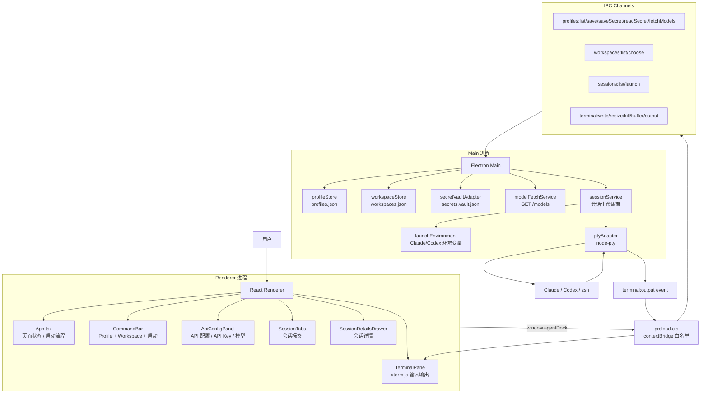

# AgentDock 项目阶段性交接文档

日期：2026-07-03  
项目路径：`/Users/peyoba/Desktop/web/AgentDock`  
项目版本：`agentdock@0.1.0`  
当前阶段：MVP 已进入可本地使用、可打包测试、可继续迭代维护阶段  
正式打包 App：`release/AgentDock-darwin-arm64/AgentDock.app`

---

## 1. 交接结论

AgentDock 目前已经完成 MVP 主线开发：它是一个 macOS Electron 桌面 App，用于在一个窗口里管理多套 Claude / Codex 等 AI CLI 配置，并以内嵌终端方式启动独立会话。

当前版本已经可以：

- 管理多个 API 配置 Profile。
- 为 Claude / Codex 注入独立 endpoint、API Key、模型和工作区。
- 用本机加密 vault 保存 API Key，避免频繁弹出 macOS 系统密码。
- 在 renderer / preload / IPC 边界避免默认暴露完整 secret 或完整 env。
- 选择本地工作区路径并持久化，下次从下拉框直接选择。
- 启动真实 `node-pty` 内嵌终端，并用 `xterm.js` 显示交互输出。
- 支持会话标签页、终端滚动历史、终端 resize、写入、关闭。
- 支持 API Key 眼睛按钮显示/隐藏。
- 支持从 endpoint 拉取模型候选，再由用户勾选常用模型。
- 支持手动添加/删除常用模型。
- 支持打包为 macOS App 并通过本地 ad-hoc codesign 验证。

当前项目适合继续做产品化打磨和稳定性增强；尚不等同于面向外部分发的正式商业版本，因为还没有做 notarization、安装包、自动更新、错误遥测、配置迁移体系和长期兼容策略。

---

## 2. 项目定位

### 2.1 要解决的问题

Claude CLI、Codex CLI 等 AI 工具通常依赖全局配置、环境变量或工具自己的配置目录。用户如果想同时使用多个 API 提供商、多个 endpoint、多个 API Key 或多个模型配置，就容易遇到：

- 全局配置来回切换。
- 一个终端会话影响另一个终端会话。
- API Key 管理混乱。
- 多个项目目录之间启动成本高。
- CLI 原生终端窗口分散，不容易集中管理。

AgentDock 的目标是把这些能力收纳到一个桌面工作台里：

```text
一个窗口，多套 API 配置，多个工作区，多个独立内嵌终端会话。
```

### 2.2 核心原则

1. **不修改全局配置来切换 endpoint/key**：每次启动会话时按 Profile 注入隔离环境。
2. **Profile 与 Workspace 解耦**：同一套 API 配置可以进入不同项目目录，同一项目也可以启动不同 API 配置。
3. **Secret 不默认暴露到 Renderer**：API Key 默认只存在 main 进程管理的本机加密 vault；用户点击眼睛按钮才读取并显示。
4. **Codex 必须隔离 `CODEX_HOME`**：每个 Codex Profile 使用独立配置目录，避免污染全局 Codex 配置。
5. **内嵌终端优先**：统一使用 `xterm.js + node-pty`，不依赖外部 Terminal.app / iTerm2。
6. **用户体验优先**：隐藏普通用户不需要修改的内部字段；高级字段只读、默认折叠。

---

## 3. 当前功能状态

### 3.1 已完成能力

| 模块 | 当前状态 | 说明 |
|---|---|---|
| 桌面 App 框架 | 已完成 | Electron + React + TypeScript + Vite。 |
| 主界面 | 已完成 | 顶部品牌区、API 配置入口、Profile/Workspace 选择、启动终端、zsh 本地终端按钮。 |
| API 配置页 | 已完成 | 独立页面，按 Claude / Codex / Gemini / OpenCode / 全部分组。 |
| 多 Profile | 已完成 | 支持新增、编辑、保存多套 endpoint/key/model 配置。 |
| Profile 删除 | 未完成 | 后续应补充删除或禁用配置功能。 |
| API Key 保存 | 已完成 | 使用本机加密 vault：`secrets.vault.json`，不再默认使用 Keychain 主流程。 |
| API Key 显示/隐藏 | 已完成 | 输入框内右侧眼睛按钮；默认圆点，点击后明文显示。 |
| Key 解密失败恢复 | 已完成 | 统一提示用户重新粘贴并保存一次修复本机加密记录。 |
| 模型拉取 | 已完成 | 调用 provider `/models`；失败时做可恢复错误提示。 |
| 常用模型 | 已完成 | 拉取后显示候选列表，用户勾选后才保存为常用模型。 |
| 默认模型 | 已完成 | 无常用模型时可手动输入；有常用模型时从下拉中选择。 |
| Workspace 选择 | 已完成 | 通过系统目录选择器选择路径，保存后下次从下拉框选择。 |
| 独立终端会话 | 已完成 | SessionService + node-pty + xterm.js。 |
| 会话标签 | 已完成 | 支持多个会话 tab，切换和关闭。 |
| 会话详情 | 已完成 | 默认收起，可展开查看 profile/workspace/command 等信息。 |
| 终端滚动历史 | 已完成 | Renderer xterm scrollback + main 进程 replay buffer。 |
| 终端 resize | 已完成 | 终端容器按可用空间 fit，并同步 resize PTY。 |
| macOS 窗口 | 已完成 | 可移动、可缩放，自定义 titlebar 与窗口控制区协调。 |
| 打包 | 已完成 | `npm run package:mac` 生成 `release/AgentDock-darwin-arm64/AgentDock.app`。 |
| 签名 | 已完成 | 本地 ad-hoc codesign；未 notarize。 |

### 3.2 最新默认启动命令

用户已经明确指定 Claude / Codex 默认启动命令为危险权限跳过模式。当前实现位于 `src/renderer/App.tsx` 的 `defaultCommandFor(profile)`：

| Profile 类型 | 默认启动命令 |
|---|---|
| Claude | `claude --dangerously-skip-permissions` |
| Codex | `codex --dangerously-bypass-approvals-and-sandbox` |
| Gemini | `gemini` |
| OpenCode | `opencode` |
| 本地终端按钮 | `zsh` |

注意：这两个 `dangerously` 参数意味着 CLI 内部的权限确认/沙箱限制会被跳过。当前是用户明确要求的默认行为；如果后续面向更多用户，建议把它做成高级设置或 Profile 级开关，而不是强制默认。

### 3.3 当前默认 API 配置

默认配置统一放在：

```text
src/shared/defaultApiProfiles.ts
```

当前默认 Profile 只保留默认模型，不预填常用模型列表：

- `Claude · AnyRouter A`
  - `id`: `claude-anyrouter`
  - `baseUrl`: `https://anyrouter.top`
  - `defaultModel`: `claude-3-5-haiku-20241022`
- `Codex · AnyRouter`
  - `id`: `codex-openai`
  - `baseUrl`: `https://anyrouter.top/v1`
  - `defaultModel`: `gpt-5-codex`
  - `codexHome`: `~/.agentdock/codex-profiles/codex-openai`

设计原因：用户认为初始状态除了默认模型外，备选/常用模型可以为空，由用户拉取后自行选择。

---

## 4. 技术架构

### 4.1 技术栈

| 层级 | 技术 |
|---|---|
| 桌面壳 | Electron 37 |
| UI | React 19 |
| 语言 | TypeScript / NodeNext |
| 构建 | Vite 7 + TypeScript compiler |
| 终端显示 | `@xterm/xterm` |
| PTY | `node-pty` |
| 密钥原生依赖 | `keytar` 保留为 optional dependency，但主流程使用 encrypted vault |
| 测试 | Vitest + React Testing Library + jsdom |
| 打包 | `@electron/packager` |
| 签名 | macOS `codesign --force --deep --sign -` |

### 4.2 逻辑架构图



### 4.3 数据流：启动一个 Claude/Codex 会话

1. 用户在主界面选择 API Profile。
2. 用户选择 Workspace。
3. 用户点击“启动终端”。
4. Renderer 调用 `window.agentDock.launchSession({ profileId, workspaceId, command })`。
5. Preload 通过白名单 IPC 调用 main：`sessions:launch`。
6. Main 查询 Profile/Workspace。
7. SessionService 读取 API Key：
   - 当前主流程从本机 encrypted vault 读取。
8. SessionService 构造启动环境：
   - Claude：注入 `ANTHROPIC_BASE_URL`、`ANTHROPIC_AUTH_TOKEN`。
   - Codex：注入 `OPENAI_BASE_URL`、`OPENAI_API_KEY`、`CODEX_HOME`。
9. 如果是 Codex：
   - 确保 `CODEX_HOME` 目录存在。
   - 写入独立 `config.toml`，包含 model/provider/base_url/env_key。
10. node-pty 在 Workspace 路径启动命令。
11. PTY 输出通过 main 进程事件转发到 renderer。
12. Renderer 的 `TerminalPane` 用 xterm.js 显示输出，并处理输入、resize、滚动。

### 4.4 数据流：API Key 保存和显示

1. 用户在 API 配置页输入 API Key。
2. 点击保存配置。
3. Renderer 先保存 Profile metadata，再调用 `profiles:saveSecret`。
4. Main 写入本机 encrypted vault。
5. 默认不会把完整 API Key 返回 renderer。
6. 用户点击眼睛按钮时，才调用 `profiles:readSecret` 读取并显示在同一个输入框内。
7. 如果旧记录解密失败，统一提示：

```text
无法读取已保存的 API Key，请重新粘贴并保存一次以修复本机加密记录。
```

### 4.5 数据流：模型拉取和常用模型

1. 用户点击“拉取模型”。
2. Renderer 调用 `profiles:fetchModels`。
3. Main 找到 Profile，并从 vault 读取 API Key。
4. `modelFetchService` 调用 `${baseUrl}/models`。
5. Renderer 显示“拉取到的模型”候选 checkbox 列表。
6. 用户勾选的模型才加入“常用模型列表”。
7. 保存配置时只保存用户选择的常用模型，即 `availableModels`。
8. 默认模型：
   - 无常用模型时是手动输入框。
   - 有常用模型时是下拉框。

关键原则：**拉取模型只是候选，不自动保存全部模型。**

---

## 5. 重要目录和文件说明

### 5.1 源码目录

```text
src/
  main/                       Electron main 进程
  preload/                    contextBridge / IPC 白名单
  renderer/                   React UI / xterm 前端
  shared/                     main/preload/renderer 共享类型和常量
  test/                       测试 setup
```

### 5.2 Main 进程关键文件

| 文件 | 作用 |
|---|---|
| `src/main/main.ts` | Electron 入口、窗口创建、IPC handler 注册、默认 Profile/Workspace 合并。 |
| `src/main/sessionService.ts` | 会话生命周期核心：launch/list/write/resize/kill/buffer/output。 |
| `src/main/launchEnvironment.ts` | 按 Profile 类型生成 Claude/Codex 环境变量。 |
| `src/main/modelFetchService.ts` | 使用当前 Profile 的 baseUrl/API Key 拉取 `/models`。 |
| `src/main/adapters/ptyAdapter.ts` | `node-pty` adapter，处理 PATH、shell 启动、命令参数。 |
| `src/main/adapters/secretVaultAdapter.ts` | 本机 encrypted vault；主流程 API Key 存储。 |
| `src/main/adapters/keychainAdapter.ts` | macOS Keychain adapter，保留但当前不是主默认存储路径。 |
| `src/main/stores/profileStore.ts` | Profile metadata JSON store。 |
| `src/main/stores/workspaceStore.ts` | Workspace JSON store。 |
| `src/main/workspaceService.ts` | 从本地路径创建 workspace、合并默认和用户 workspace。 |

### 5.3 Renderer 关键文件

| 文件 | 作用 |
|---|---|
| `src/renderer/App.tsx` | 顶层状态、页面切换、Profile/Workspace 选择、默认启动命令、session launch。 |
| `src/renderer/components/CommandBar.tsx` | 主界面启动区：API 配置、工作区、zsh、启动终端。 |
| `src/renderer/components/ApiConfigPanel.tsx` | API 配置页：Profile、Base URL、API Key、模型拉取/常用模型、高级字段。 |
| `src/renderer/components/TerminalPane.tsx` | xterm.js 终端显示、输入输出、resize、scrollback、buffer replay。 |
| `src/renderer/components/SessionTabs.tsx` | 会话 tab 展示、切换、关闭。 |
| `src/renderer/components/SessionDetailsDrawer.tsx` | 当前会话详情，默认收起。 |
| `src/renderer/styles.css` | 全局 UI 样式、窗口拖拽区域、终端布局、配置页样式。 |
| `src/renderer/terminalOutput.ts` | 终端输出相关处理。 |

### 5.4 Shared 关键文件

| 文件 | 作用 |
|---|---|
| `src/shared/agentdockTypes.ts` | Profile、Workspace、Session、Terminal IPC 请求类型。 |
| `src/shared/preloadTypes.ts` | `window.agentDock` API 类型合同。 |
| `src/shared/defaultApiProfiles.ts` | 默认 Claude/Codex Profile 单一来源。 |
| `src/shared/secretPreview.ts` | Secret/env 脱敏预览工具。 |

### 5.5 文档目录

| 文件/目录 | 作用 |
|---|---|
| `docs/requirements/` | 立项、UI、MVP、竞品、架构等需求文档。 |
| `docs/plans/` | Phase 1 / Phase 2 实施计划。 |
| `docs/assets/mockups/` | UI mockup HTML/PNG。 |
| `docs/assets/ui-references/` | 竞品/参考 UI 截图。 |
| `docs/reports/2026-07-03-agentdock-mvp-phase-summary.md` | MVP 阶段总结报告。 |
| `docs/reports/2026-07-03-agentdock-project-handoff.md` | 当前交接文档。 |

---

## 6. 本地运行、测试和打包

### 6.1 安装依赖

```bash
cd /Users/peyoba/Desktop/web/AgentDock
npm install
```

注意：`keytar` 和 `node-pty` 是 optional native dependencies。打包和真实终端运行依赖 `node-pty` 可用。

### 6.2 开发运行

```bash
npm run dev
```

该命令会并行启动：

- Vite renderer dev server：`127.0.0.1:5173`
- Electron main 进程

### 6.3 测试

```bash
npm test
```

最近一次完整验证：

```text
Test Files  24 passed (24)
Tests       94 passed (94)
```

常用定向测试：

```bash
npm test -- tests/app/App.test.tsx
npm test -- tests/app/secretVaultAdapter.test.ts
npm test -- tests/app/sessionService.test.ts
npm test -- tests/app/ptyAdapter.test.ts
npm test -- tests/app/modelFetchService.test.ts
```

### 6.4 类型检查

```bash
npm run typecheck
```

### 6.5 构建

```bash
npm run build
```

构建输出：

```text
dist/main/
dist/renderer/
dist/preload/
```

### 6.6 打包 macOS App

```bash
npm run package:mac
```

输出：

```text
release/AgentDock-darwin-arm64/AgentDock.app
```

该命令包含：

- `npm run build`
- `electron-packager`
- native `.node` 和 `spawn-helper` asar unpack
- ad-hoc codesign

### 6.7 验证签名

```bash
codesign --verify --deep --strict --verbose=2 release/AgentDock-darwin-arm64/AgentDock.app
```

最近一次验证通过：

```text
release/AgentDock-darwin-arm64/AgentDock.app: valid on disk
release/AgentDock-darwin-arm64/AgentDock.app: satisfies its Designated Requirement
```

---

## 7. 配置和本地数据

### 7.1 Electron userData

运行时数据存放在 Electron `app.getPath('userData')` 下。不同机器上路径由 Electron/macOS 决定，常见位置类似：

```text
~/Library/Application Support/AgentDock/
```

主要文件：

| 文件 | 内容 |
|---|---|
| `profiles.json` | 用户保存的 API Profile metadata，不应包含 API Key。 |
| `workspaces.json` | 用户选择并保存的工作区路径。 |
| `secrets.vault.json` | 本机加密后的 API Key 记录。不得提交 Git。 |
| `codex-profiles/` 或用户配置的 `~/.agentdock/codex-profiles/...` | Codex Profile 隔离目录。 |

### 7.2 不应提交到 Git 的内容

任何时候推送 GitHub 前都要检查：

- `.env` / `.env.*`
- `secrets.vault.json`
- 真实 API Key / token / JWT / private key
- `node_modules/`
- `dist/`
- `release/`
- `*.asar`
- 本机用户目录下的敏感配置

用户已经明确要求：**推送 GitHub 前必须做安全检查，不能上传重要信息。**

---

## 8. 测试覆盖重点

当前测试集中在 `tests/app/`。重点覆盖包括：

| 测试文件 | 覆盖内容 |
|---|---|
| `tests/app/App.test.tsx` | 主 UI、API 配置、启动流程、模型拉取、API Key 显示、工作区选择、默认命令。 |
| `tests/app/defaultApiProfiles.test.ts` | 默认 Profile 只保留 defaultModel，不预填 availableModels。 |
| `tests/app/sessionService.test.ts` | 会话启动、环境注入、session lifecycle。 |
| `tests/app/sessionSecurity.test.ts` | Session 安全边界、secret/env 不泄露。 |
| `tests/app/sessionFailure.test.ts` | 启动失败安全处理。 |
| `tests/app/ptyAdapter.test.ts` | node-pty spawn 行为、PATH、zsh 特殊处理。 |
| `tests/app/secretVaultAdapter.test.ts` | encrypted vault 写入/读取/解密失败处理。 |
| `tests/app/modelFetchService.test.ts` | `/models` 拉取、错误处理、provider URL 处理。 |
| `tests/app/metadataStores.test.ts` | Profile/Workspace store 不保存 secret/env。 |
| `tests/app/layoutPolish.test.ts` | 主界面布局和样式约束。 |

维护建议：任何涉及 UI 行为、IPC 行为、secret 处理、launch 环境的修改都必须先补测试，再改实现。

---

## 9. 关键设计决策记录

### 9.1 从 Keychain 主流程改为本机 encrypted vault

最初 Phase 2 接入了真实 macOS Keychain。但用户实际测试发现 macOS 系统密码弹窗太频繁，不符合产品体验。因此主流程改为本机 encrypted vault。

当前状态：

- `secretVaultAdapter.ts` 是主流程。
- `keychainAdapter.ts` 保留，便于未来迁移或特殊场景。
- 旧 vault 记录如果解密失败，只能重新粘贴 API Key 并保存一次修复。

### 9.2 Codex 使用独立 `CODEX_HOME`

Codex 不能仅靠 API Key 登录，需要通过独立配置目录写入 provider/model/base_url/env_key。AgentDock 为每个 Codex Profile 维护独立 `CODEX_HOME`。

核心文件：

- `src/main/launchEnvironment.ts`
- `src/main/sessionService.ts` 中的 `buildCodexConfig()`

### 9.3 常用模型不是固定预设

曾经实现过固定 Claude/Codex 模型快捷按钮，但用户澄清：常用模型应该来自“拉取到的模型”中由用户自定义选择。

当前规则：

- 拉取模型只产生候选列表。
- 用户勾选后才保存到 `availableModels`。
- 未勾选的模型不保存。
- 手动添加仍然可用。

### 9.4 默认启动命令包含危险权限跳过参数

用户明确要求：

- Codex：`codex --dangerously-bypass-approvals-and-sandbox`
- Claude：`claude --dangerously-skip-permissions`

当前已作为默认命令写入 `defaultCommandFor(profile)`。后续如果要面向更广泛用户，建议做成 Profile 高级配置项。

### 9.5 高级字段默认隐藏且只读

用户认为这些字段对普通使用者没有意义：

- 配置 ID
- Keychain Service
- Keychain Account
- Codex Home

当前处理：默认隐藏，展开“高级设置”后只读展示。

---

## 10. 已知问题和后续 TODO

### 10.1 高优先级

1. **Profile 删除/禁用**
   - 当前支持新增和编辑，但没有删除。
   - 建议做软删除或显式确认删除。

2. **危险启动参数可配置化**
   - 当前 Claude/Codex 默认带 `dangerously` 参数。
   - 建议后续在高级设置中做 per-profile 开关，并默认按用户当前偏好开启。

3. **配置迁移机制**
   - 目前 profile/workspace/vault 都是简单 JSON 文件。
   - 后续字段变化多时，应加入 schema version 和 migration。

4. **错误提示继续中文化和分类**
   - 已处理 key decrypt 和 fetchModels 主要路径。
   - 其他底层错误仍可能是英文，需要逐步规范。

5. **安全审计和 GitHub 推送前检查自动化**
   - 用户要求推送前做安全检查。
   - 建议增加脚本扫描 staged diff 中的 secret pattern。

### 10.2 中优先级

1. **Workspace 管理页**
   - 当前路径选择已满足 MVP。
   - 后续可做删除、重命名、最近打开排序。

2. **Session 重启**
   - 当前可启动/关闭，未做 restart。

3. **会话恢复策略**
   - 当前 app 重启后不会恢复旧 PTY，只能新建。
   - 后续可保存历史 session metadata 或 terminal transcript。

4. **模型拉取体验增强**
   - 增加搜索、过滤、按 provider 分组、批量选择。

5. **日志与诊断面板**
   - 方便用户反馈“启动失败”“命令不存在”“模型拉取失败”等问题。

6. **UI 继续打磨**
   - 当前可用，但可以继续优化视觉层级、空状态、滚动条、窗口尺寸适配。

### 10.3 低优先级 / 发布阶段

1. **notarization**
2. **DMG/PKG 安装包**
3. **自动更新**
4. **崩溃上报 / telemetry**
5. **多语言**
6. **更完整的 provider 兼容层**

---

## 11. 常见维护场景

### 11.1 用户说 API Key 显示失败 / 拉取模型失败

优先检查：

- 是否是旧 vault 记录无法解密。
- UI 是否显示中文恢复提示。
- 用户是否需要重新粘贴 API Key 并保存一次。

相关文件：

- `src/main/adapters/secretVaultAdapter.ts`
- `src/renderer/components/ApiConfigPanel.tsx`
- `tests/app/secretVaultAdapter.test.ts`
- `tests/app/App.test.tsx`

### 11.2 用户说 Codex endpoint/key 没生效

检查：

- `CODEX_HOME` 是否创建成功。
- `CODEX_HOME/config.toml` 是否写入正确 base_url/model/env_key。
- `OPENAI_API_KEY` 是否注入到 PTY env。
- 启动命令是否是 Codex Profile 派生出来的。

相关文件：

- `src/main/launchEnvironment.ts`
- `src/main/sessionService.ts`
- `src/main/adapters/ptyAdapter.ts`

### 11.3 用户说终端无法滚动 / 内容丢失 / 宽度不对

检查：

- `TerminalPane.tsx` 的 xterm 初始化、scrollback、fit/resize。
- main 进程 `terminalBuffers` replay buffer。
- CSS 中 terminal 容器尺寸是否被改坏。

相关文件：

- `src/renderer/components/TerminalPane.tsx`
- `src/main/sessionService.ts`
- `src/renderer/styles.css`

### 11.4 用户说窗口不能拖动/缩放

检查：

- `BrowserWindow` 的 `resizable/minWidth/minHeight/titleBarStyle`。
- CSS 中 `-webkit-app-region: drag/no-drag`。

相关文件：

- `src/main/main.ts`
- `src/renderer/styles.css`

### 11.5 用户要求推送 GitHub

必须先做：

```bash
git status --short
git diff --cached
```

确认没有：

- 真实 API Key
- `.env`
- `secrets.vault.json`
- `dist/`
- `release/`
- `.asar`
- `node_modules/`

再测试：

```bash
npm test
npm run typecheck
npm run build
```

再 commit/push。

---

## 12. 当前工作区状态说明

截至本交接文档生成时，工作区存在未提交改动。这些改动包括最近一轮 MVP 后续修复和文档：

- API Key eye toggle 和 vault 解密失败中文提示。
- fetchModels 解密失败中文提示。
- 常用模型从拉取结果中自定义勾选。
- 默认 Profile 不预填备选模型。
- Claude/Codex 默认启动命令带用户指定的危险跳过权限参数。
- MVP 总结报告和本交接文档。

如果后续要推送 GitHub，需要先做安全检查和 staged diff 审核。

---

## 13. 接手建议

新接手开发者建议按以下顺序理解项目：

1. 阅读本文档。
2. 阅读 `docs/reports/2026-07-03-agentdock-mvp-phase-summary.md`。
3. 阅读 `docs/requirements/README.md` 和 `docs/requirements/06-技术架构方案.md`。
4. 看 `src/shared/agentdockTypes.ts` 理解领域对象。
5. 看 `src/shared/preloadTypes.ts` 理解 renderer 可调用 API。
6. 看 `src/main/main.ts` 理解 IPC 和持久化入口。
7. 看 `src/main/sessionService.ts` 理解会话生命周期。
8. 看 `src/renderer/App.tsx` 理解 UI 状态流和启动命令。
9. 看 `src/renderer/components/ApiConfigPanel.tsx` 理解配置页。
10. 跑测试：`npm test`。
11. 跑打包：`npm run package:mac`。
12. 手动启动 `release/AgentDock-darwin-arm64/AgentDock.app` 验证 UI 和终端。

---

## 14. 当前阶段总结

AgentDock MVP 的核心闭环已经打通：

```text
配置 Profile → 保存 API Key → 选择 Workspace → 生成隔离环境 → 启动内嵌终端 → 使用 Claude/Codex → 管理会话
```

后续开发重点不再是“能不能跑起来”，而是：

- 更安全的默认行为和可配置权限策略。
- 更完整的 Profile/Workspace 管理。
- 更稳定的异常恢复和迁移机制。
- 更精致的 UI 体验。
- 更规范的发布流程。

只要遵守当前安全边界、测试策略和打包验证流程，后续开发者可以比较顺畅地继续维护和迭代。
